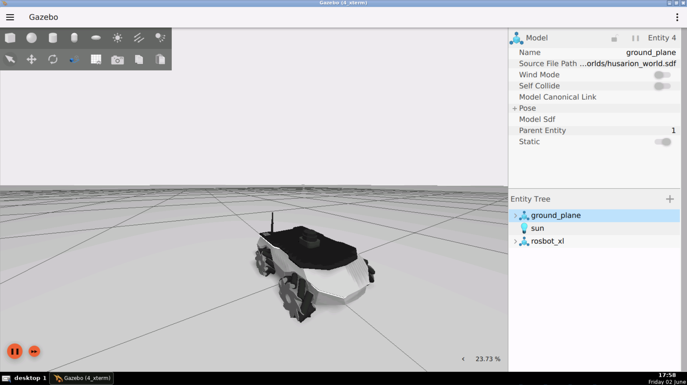
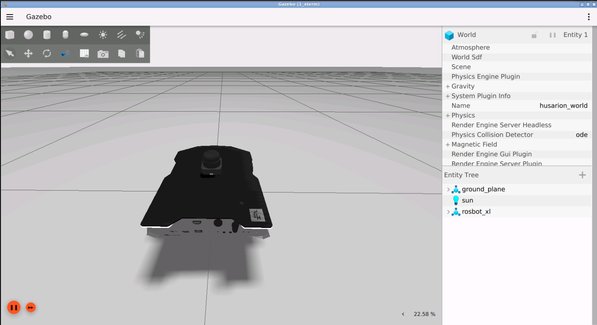

# checkpoint17_distance_controller

This project goal is to move robot in forward direction with PID controller. It would move the robot 1 meter, 2 meter ,and 3 meter and stop on empty world simulation






- To do parameter testing
```
ros2 run distance_controller distance_controller 1.0 0.1 0.0005  2>&1 >/dev/null | grep Summary
```
- To examination 
```
ros2 run distance_controller distance_controller
```